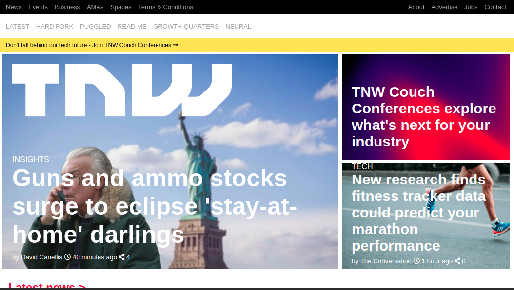

# BuildingWithResponsiveDesign

This project is focused on creating responsive homepage of The Next Web's homepage through css. In this project we're required to create homepage of[The Next Web](https://thenextweb.com)

In this task we were required to create a responsive homepage clone of The Next Web using the best practices of HTML AND CSS with GitHub process flow.

## Built With

- HTML,
- CSS3,

## Live Demo

[Live Demo Link](https://rawcdn.githack.com/tadeuasarro/BuildingWithResponsiveDesign/3157860849ca8d60e0087933f1fe5cdf139f6b10/index.html)

## Authors

👤 Tadeu Sarro

- Github: [@tadeuasarro](https://github.com/tadeuasarro)
- Twitter: [@tadeuasarro](https://twitter.com/tadeuasarro)
- Linkedin: [@tadeuasarro](https://www.linkedin.com/in/tadeu-sarro-71481013a/)

👤 Prabhakar Pandey

- Github: [@githubhandle](https://github.com/Prabhakarzx)
- Twitter: [@twitterhandle](https://twitter.com/prabhakarzx)
- Linkedin: [linkedin](https://www.linkedin.com/in/prabhakarzx/)

## 🤝 Contributing

Contributions, issues and feature requests are welcome!

Feel free to check the [issues page](https://github.com/tadeuasarro/BuildingWithResponsiveDesign/issues)

## Show your support

Give a ⭐️ if you like this project!

## Acknowledgments

- Microverse
- GitHub
- TheOdinProject

## 📝 License

This project is open licensed.